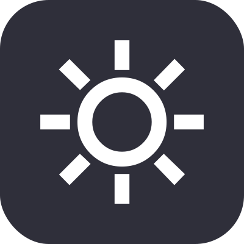
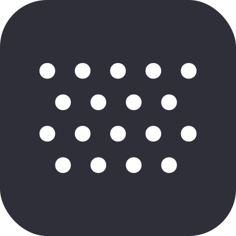
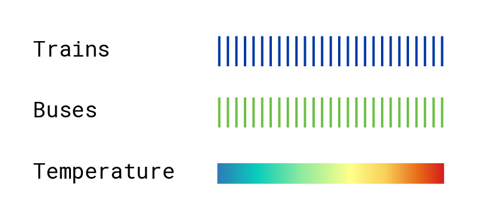

<link rel="stylesheet" href="./jquery-ui.css" type="text/css">

<link rel="stylesheet" href="npm:jquery-ui/dist/themes/base/jquery-ui.css">

<link rel="preconnect" href="https://fonts.googleapis.com">
<link rel="preconnect" href="https://fonts.gstatic.com" crossorigin>
<link href="https://fonts.googleapis.com/css2?family=Inter:wght@400;500;600;700&family=Roboto+Mono:wght@400;500;600;700&display=swap" rel="stylesheet">

<nav id="left-panel" class="mta-sidebar">
    <ol class="sidebar-contents">
        <li class="sidebar-intro">
            <div id="splash-title">
            <h1>
            <p id="year-of-text">A Year of</p> 
            <p id="mta-transit-text">MTA Transit</p>
            </h1>
            </div>
            <p id="subtitle">How did weather affect ridership for trains and buses in 2023?</p>
            <p id="blurb">This infographic shows the MTA’s daily public transportation ridership as the percentage change from average (calculated for both weekdays and weekends). Explore how weather impacts ridership using the filters below.</p>
        </li>
        <li id="temps">
            <div id="temp-filter">
                <div id="temp-filter-title">
                    <div id="temp-unit-selector">
                        <label for="temp-range" id="temp-label">Temperature Range:</label>
                        <div id="temp-toggle">
                            <div class="temp-unit-button" id="fahrenheit">°F</div>
                            <div class="temp-unit-button selected-temp" id="celsius">°C</div>
                        </div>
                    </div>
                </div>
            </div>
            <div id="temp-range-container">
                <div id="temp-range-inputs">
                    <p>
                        <input class="temp-range-input" type="text" id="temp-range-min" inputmode="decimal" placeholder="Min">
                    </p>
                    <p>
                        <input class="temp-range-input" type="text" id="temp-range-max" inputmode="decimal" placeholder="Max">
                    </p>
                </div>
                <div class="slider-container">
                    <div class="slider-track-wrap">
                        <div id="slider"></div>
                    </div>
                    <div class="slider-labels" id="slider-labels" aria-hidden="true"></div>
                </div>
            </div>
        </li>
        <li id="filters-groups">
            <div id="filters-title" class="">Filters</div>
            <ol id="transport-icon-list">
                <li class="icon-li active" id="bus-button"><p>bus</p></li>
                <li class="icon-li active" id="train-button"><p>train</p></li>
            </ol> 
            <ol id="weather-icon-list">
                <li class="icon-li inactive" id="rain-button"><p>rain</p></li>
                <li class="icon-li inactive" id="sun-button"><p>sun</p></li>
                <li class="icon-li inactive" id="snow-button"><p>snow</p></li>
                <li class="icon-li inactive" id="cloud-button"><p>cloudy</p></li>
            </ol>
            <ol id="buttons-list">
                <li id="reset-button" class="button"><p>Reset</p></li>
            </ol>
        </li>
    </ol>
</nav>

<div id="container">
    <div id="legend"></div>
    <div id="tooltip-wrapper">
            <div id="tooltip">
                <div id="tooltip-info">
                    <p>Hover over a bar in the chart to display info for that day</p>
                </div>
                <div id="rain-vid-container">
                    <video autoplay muted loop>
                        <source src="assets/rain.mp4" type="video/mp4">
                    </video>
                </div>
                <div id="snow-vid-container">
                    <video autoplay muted loop>
                        <source src="assets/snow.mp4" type="video/mp4">
                    </video>
                </div>
                <div id="sun-vid-container">
                    <video autoplay muted loop>
                        <source src="assets/sun.mp4" type="video/mp4">
                    </video>
                </div>
                <div id="cloud-vid-container">
                    <video autoplay muted loop>
                        <source src="assets/cloud.mp4" type="video/mp4">
                    </video>
                </div>
            </div>
        </div>
    <div id="my_dataviz">
    </div>
</div>

```js
import {chart} from "./components/mta.js";

const mta_data = await FileAttachment("./data/MTA_Daily_Ridership_Data__Beginning_2020_20240930.csv").csv();
const weather_data = await FileAttachment("./data/new york city 2023-01-01 to 2023-12-31.csv").csv();

await chart(weather_data, mta_data);
```

<style>
.mta-sidebar {
    --sidebar-bg: #14171F;
    --sidebar-text: #C7CBD3;
    --sidebar-muted: rgba(199, 203, 211, 0.72);
    --sidebar-accent: #464951;
    --sidebar-border: #464951;
    --sidebar-section-pad: 1.25rem;
    --sidebar-inner-gap: 1rem;
}

.mta-sidebar #splash-title,
.mta-sidebar #splash-title h1,
.mta-sidebar #year-of-text,
.mta-sidebar #mta-transit-text,
.mta-sidebar #subtitle {
    font-family: "Roboto Mono", monospace;
}
#year-of-text {
    font-size: clamp(0.875rem, 1.6vh, 1.125rem);
    font-weight: 500;
    letter-spacing: 0.02em;
    margin-bottom: 0.15rem;
    margin-top: 0;
    color: var(--sidebar-muted);
}
#mta-transit-text {
    font-size: clamp(1.25rem, 2.8vh, 1.75rem);
    font-weight: 700;
    letter-spacing: -0.02em;
    margin-top: 0;
    line-height: 1.1;
    color: var(--sidebar-text);
}
#filters-groups {
    display: flex;
    flex-direction: column;
    min-height: 0;
    flex: 0 0 auto;
    margin-top: 0;
    width: 100%;
    padding-bottom: var(--sidebar-section-pad);
    box-sizing: border-box;
}
#filters-groups #filters-title {
    padding-bottom: 0.625rem;
}
#filters-groups ol {
    padding-bottom: 0.25rem;
    padding-top: 0.35rem;
}
#filters-groups #buttons-list {
    padding: 0;
    margin-top: var(--sidebar-inner-gap);
}
#filters-title {
    margin-inline: calc(-1 * var(--sidebar-pad-x));
    padding-inline: var(--sidebar-pad-x);
    border-top: 1px solid var(--sidebar-border);
    border-bottom: none;
    font-size: 0.6875rem;
    font-weight: 600;
    letter-spacing: 0.1em;
    text-transform: uppercase;
    padding-top: var(--sidebar-section-pad) !important;
    color: var(--sidebar-muted);
}
#buttons-list {
    display: flex;
    flex-flow: row;
    justify-content: flex-start;
    padding: 0;
    margin: 0;
}
.mta-sidebar .button,
#reset-button {
    border-radius: 999px;
    min-width: 5rem;
    height: 2.25rem;
    border: 1px solid var(--sidebar-border);
    text-align: center;
    padding: 0 1.25rem;
    box-sizing: border-box;
    list-style: none;
}
#transport-icon-list, #weather-icon-list {
    display: flex;
    flex-flow: column;
    justify-content: flex-start;
    padding-left: 0;
    gap: 0.35rem;
}
.icon-li p {
    height: 100%;
    margin: 0;
    display: flex;
    align-items: center;
}
#weather-icon-list {
    margin-inline: calc(-1 * var(--sidebar-pad-x));
    padding-inline: var(--sidebar-pad-x);
    border-bottom: 1px solid var(--sidebar-border);
    padding-top: 0.35rem !important;
    padding-bottom: 0.5rem !important;
}
#transport-icon-list li {
    padding: 0.4rem 0.65rem;
    width: 100%;
    border-radius: 8px;
    box-sizing: border-box;
    transition: background-color 0.15s ease, opacity 0.15s ease;
}
#transport-icon-list .icon-li.active {
    background-color: var(--sidebar-accent);
}
#transport-icon-list .icon-li.inactive {
    background-color: transparent;
    opacity: 0.45;
}
#transport-icon-list li img {
    max-width: 10px;
}
.mta-sidebar .icon-li {
    width: 100%;
    display: flex;
    flex-direction: row;
    align-items: center;
    gap: 0.5rem;
    overflow: visible;
    min-height: 1.75rem;
    padding: 0.4rem 0.65rem;
    border-radius: 8px;
    box-sizing: border-box;
    cursor: pointer;
    transition: background-color 0.15s ease;
    background-color: transparent;
}
.mta-sidebar .icon-li p {
    font-size: 0.8125rem;
    font-weight: 500;
    text-transform: lowercase;
    color: var(--sidebar-text);
}
.old-icon-li {
    border-radius: 25px;
    border: 2px solid;
    display: flex;
    align-items: center;
    align-content: center;
    justify-items: center;
    justify-content: center;
    padding: 10px;
}
.icon-li img {
    max-width: 10px;
}
#subtitle {
    font-size: clamp(0.9rem, 1.8vh, 1.125rem);
    font-weight: 500;
    line-height: 1.35;
    color: var(--sidebar-text);
    padding-bottom: 0;
}
#reset-button p{
    margin: 0px;
    text-align: center;
}
#reset-button {
      display: flex;
    align-items: center;
    justify-items: center;
    align-content: center;
    justify-content: center;
}
#left-panel {
    height: 100vh;
    height: 100dvh;
    overflow: hidden;
}
.hero {
  display: flex;
  flex-direction: column;
  align-items: center;
  font-family: var(--sans-serif);
  margin: 4rem 0 8rem;
  text-wrap: balance;
  text-align: center;
}
#blurb {
    font-size: clamp(0.825rem, 1.5vh, 0.975rem);
    line-height: 1.4;
    color: var(--sidebar-muted);
    font-weight: 400;
}
.mta-sidebar {
    --sidebar-pad-x: 1.5rem;
    --sidebar-pad-y: 1.5rem;
    display: flex;
    flex-direction: column;
    position: fixed;
    left: 0;
    top: 0;
    bottom: 0;
    background: var(--sidebar-bg);
    color: var(--sidebar-text);
    font-family: "Inter", system-ui, -apple-system, sans-serif;
    width: 21.75vw;
    height: 100vh;
    height: 100dvh;
    max-height: 100dvh;
    box-sizing: border-box;
    overflow: hidden;
    padding: var(--sidebar-pad-y) var(--sidebar-pad-x);
    -webkit-font-smoothing: antialiased;
}
.mta-sidebar ol.sidebar-contents {
    flex: 1;
    display: flex;
    flex-direction: column;
    justify-content: flex-start;
    gap: 0;
    min-height: 0;
    width: 100%;
    margin: 0;
    padding: 0;
    box-sizing: border-box;
    overflow: hidden;
    list-style: none;
}
.mta-sidebar li {
    list-style: none;
    padding: 0;
    margin: 0;
    flex-shrink: 0;
    width: 100%;
    box-sizing: border-box;
}
.sidebar-intro {
    display: flex;
    flex-direction: column;
    gap: 0.5rem;
    padding-top: var(--sidebar-section-pad);
    padding-bottom: 0;
    box-sizing: border-box;
}
.mta-sidebar .sidebar-intro #splash-title,
.mta-sidebar .sidebar-intro #subtitle,
.mta-sidebar .sidebar-intro #blurb {
    max-width: 100%;
    overflow-wrap: break-word;
    margin: 0;
}
.mta-sidebar .sidebar-intro #blurb {
    margin-bottom: var(--sidebar-section-pad);
}
#splash-title {
    padding-bottom: 0;
}
#subtitle {
    margin: 0;
}
#splash-title h1 {
    font-size: inherit;
    font-weight: inherit;
    margin: 0;
    line-height: 1.2;
}
#observablehq-center {
    margin-left: 0px;
    margin-top: 0px;
    margin-bottom: 0px;
    background-color: white;
    padding-right: 0px;
    overflow: hidden;
}
#observablehq-footer {
    display: none;
}
#bus_dataviz {
    position: absolute;
}
#train_dataviz {
    position: absolute;
}
#temp_dataviz {
    position: absolute;
}
#my_dataviz {
    position: absolute;
    left: 50%;
    top: 50%;
    transform: translate(-50%,-50%);
    width: 100%;
    height: 100%;
    display: flex;
    align-items: center;
    justify-content: center;
    margin: auto;
    text-align: center;
    overflow: hidden;
    isolation: isolate;
}
#my_dataviz svg {
    display: block;
    width: 100%;
    height: 100%;
    max-width: 100%;
    max-height: 100%;
    flex: 0 0 auto;
}
#container {
    --center-circle-bg: #14171F;
    container-type: size;
    max-width: 78.25vw;
    position: absolute;
    width: 78.25vw;
    height: 100vh;
    transform: translate(21.75vw, 0);
    text-align: center;
}
#observablehq-main {
    min-width: 100vw;
    margin-top: 0px;
    margin: 0;
    padding: 0;
    padding-right: 0 !important;
    margin-bottom: 0px;
    height: 100%;
    min-height: 100%;
}
#observablehq-center {
    margin-right: 0px;
    max-width: 100vw;
    height: 100%;
}
#tooltip-wrapper {
    position: absolute;
    box-sizing: border-box;
    width: 28cqmin;
    height: 28cqmin;
    aspect-ratio: 1;
    left: 50%;
    top: 50%;
    transform: translate(-50%,-50%);
    background-color: var(--center-circle-bg, #14171F);
    font-family: "Roboto Mono", monospace;
    overflow: hidden;
    border-radius: 50%;
    clip-path: circle(50% at 50% 50%);
}
body {
    box-sizing: border-box;
    margin: 0;
    width: 100%;
    height: 100vh;
    max-width: none;
}
#tooltip {
    position: absolute;
    inset: 0;
    box-sizing: border-box;
    text-align: center;
    background: transparent;
    color: white;
    padding: 0;
    border: 0;
    pointer-events: none;
    font-size: 1rem;
    border-radius: 50%;
    overflow: hidden;
}
#tooltip video {
    position: absolute;
    inset: 0;
    display: block;
    width: 100%;
    height: 100%;
    object-fit: cover;
    opacity: 1;
}
#observablehq-toc {
    display: none;
}
#rain-vid-container,
#snow-vid-container,
#cloud-vid-container,
#sun-vid-container {
    display: none;
    position: absolute;
    inset: 0;
    z-index: 1;
    width: 100%;
    height: 100%;
    overflow: hidden;
    border-radius: 50%;
    background: transparent;
    pointer-events: none;
}
#sun-vid-container::after {
    content: "";
    position: absolute;
    inset: 0;
    border-radius: 50%;
    background: rgba(0, 0, 0, 0.1);
    pointer-events: none;
    z-index: 1;
}
#sun-vid-container video {
    position: relative;
    z-index: 0;
}
#tooltip-info {
    position: absolute;
    inset: 0;
    z-index: 2;
    font-size: clamp(0.625rem, 0.85vw, 0.8125rem);
    padding: 1.35rem;
    max-width: 100%;
    color: white;
    background: transparent;
    display: flex;
    flex-direction: column;
    align-items: center;
    justify-content: center;
    gap: 0.35rem;
    line-height: 1.35;
    text-align: center;
    font-family: "Roboto Mono", monospace;
    pointer-events: none;
    box-sizing: border-box;
}
#tooltip-info p {
    margin: 0;
    width: 100%;
}
#tooltip-info .tooltip-date {
    font-size: clamp(0.6875rem, 0.9vw, 0.875rem);
    font-weight: 500;
    opacity: 0.9;
}
#tooltip-info .tooltip-temp {
    font-size: clamp(1rem, 1.35vw, 1.25rem);
    font-weight: 600;
    line-height: 1.2;
}
#tooltip-info .tooltip-label {
    opacity: 0.85;
}
#legend {
    display: block;
    position: absolute;
    width: 20%;
    height: auto;
}
#legend img {
    display: block;
    position: relative;
    width: 100%;
    height: 100%;
}
.mta-sidebar .active {
    background-color: var(--sidebar-accent);
}
.mta-sidebar .inactive {
    background-color: transparent;
}
#temp-unit-selector {
    display: flex;
    justify-content: space-between;
    align-items: center;
    width: 100%;
    gap: 0.75rem;
    min-width: 0;
}
#temp-label {
    flex: 1 1 auto;
    min-width: 0;
}
#temp-toggle {
    flex: 0 0 auto;
}
.temp-unit-button {
    border: 1px solid var(--sidebar-border);
    font-size: 0.6875rem;
    font-weight: 600;
    color: var(--sidebar-muted);
    cursor: pointer;
    transition: background-color 0.15s ease, color 0.15s ease;
}
#temp-filter {
    display: flex;
    flex-direction: column;
    margin: 0;
}
#fahrenheit {
    border-radius: 50% 0% 0% 50%;
    padding-top: 5px;
    padding-left: 8px;
    padding-right: 7px;
    padding-bottom: 5px;
}
#celsius {
    border-radius: 0% 50% 50% 0%;
    padding-top: 5px;
    padding-left: 7px;
    padding-right: 8px;
    padding-bottom: 5px;
}
#temp-filter-title {
    display: flex;
    flex-direction: row;
    align-items: center;
}
.selected-temp {
    background-color: var(--sidebar-accent);
    color: var(--sidebar-text);
    border-color: var(--sidebar-accent);
}
#temp-range-container {
    position: relative;
    width: 100%;
    display: flex;
    flex-direction: column;
    align-items: stretch;
    padding: 0;
    gap: var(--sidebar-inner-gap);
    overflow: visible;
}
#temp-range-inputs {
    display: grid;
    grid-template-columns: 1fr 1fr;
    column-gap: 0.75rem;
    row-gap: 0;
    width: 100%;
    overflow: visible;
}
#temp-range-inputs input { 
    width: 100%;
    min-width: 0;
    min-height: 1.65rem;
    padding: 0.35rem 0.5rem;
    background-color: var(--sidebar-accent);
    border: none;
    color: var(--sidebar-text);
    font-size: 0.8125rem;
    font-weight: 600;
    font-family: "Inter", system-ui, sans-serif;
    box-sizing: border-box;
    cursor: text;
    outline: none;
}
#temp-range-inputs input:focus {
    box-shadow: inset 0 0 0 1px #6b8fd4;
}
#temp-range-inputs p {
    margin: 0;
    min-width: 0;
    overflow: visible;
}
#temp-range-sliders input {
    position: absolute;
    pointer-events: none;
}
#temps {
    position: relative;
    margin-top: 0;
    padding: var(--sidebar-section-pad) 0;
    border-top: none;
    display: flex;
    flex-direction: column;
    gap: var(--sidebar-inner-gap);
    align-items: stretch;
    flex-shrink: 0;
    width: 100%;
    overflow: visible;
    box-sizing: border-box;
}
#temps::before {
    content: "";
    position: absolute;
    top: 0;
    left: calc(-1 * var(--sidebar-pad-x));
    width: calc(100% + 2 * var(--sidebar-pad-x));
    height: 1px;
    background: var(--sidebar-border);
}
#temp-filter-title {
    font-size: 0.8125rem;
    font-weight: 600;
    color: var(--sidebar-text);
}
#slider {
    width: 100%;
    height: 4px;
    margin: 0;
    border: none;
}
#temp-toggle {
    display: flex;
    flex-direction: row;
}
.temp-range-input {
    border-radius: 6px;
}
.slider-track-wrap {
    width: 100%;
    height: 14px;
    display: flex;
    align-items: center;
    box-sizing: border-box;
}
.mta-sidebar .slider-track-wrap .ui-slider.ui-slider-horizontal {
    width: 100%;
    height: 4px;
    border: none;
    background: transparent;
    overflow: visible;
}
.mta-sidebar .slider-track-wrap .ui-slider .ui-slider-handle {
    width: 14px;
    height: 14px;
    border-radius: 50%;
    background-color: #6b8fd4;
    border: 2px solid var(--sidebar-text);
    top: 50%;
    margin-top: -7px;
    margin-left: -7px;
    transform: none;
    box-sizing: border-box;
    z-index: 2;
}
.mta-sidebar .slider-track-wrap .ui-slider-range.ui-corner-all.ui-widget-header {
    background-color: #6b8fd4;
    height: 4px;
    top: 0;
}
.mta-sidebar .slider-track-wrap .ui-slider.ui-widget.ui-widget-content {
    border: 0;
    background: transparent;
}
.slider-labels {
    position: relative;
    width: 100%;
    min-height: 1rem;
    margin: 0;
    padding: 0 0.15rem;
    box-sizing: border-box;
    overflow: visible;
}
#temp-filter-title #temp-label {
    font-size: 0.8125rem;
    font-weight: 600;
    display: flex;
    align-items: center;
    color: var(--sidebar-text);
}
#left, #right {
    position: absolute;
    top: 0;
    color: var(--sidebar-muted);
    font-size: 0.75rem;
    font-family: "Inter", system-ui, sans-serif;
    white-space: nowrap;
    pointer-events: none;
}
#left {
    transform: translateX(0);
}
#right {
    transform: translateX(-100%);
}
.slider-container {
    width: 100%;
    padding: 0 12px;
    box-sizing: border-box;
    display: flex;
    flex-direction: column;
    align-items: stretch;
    gap: var(--sidebar-inner-gap);
    overflow: visible;
}
.mta-sidebar #reset-button.button {
    display: flex;
    align-items: center;
    justify-content: center;
    background: transparent;
    color: var(--sidebar-text);
    font-family: "Inter", system-ui, sans-serif;
    font-size: 0.8125rem;
    font-weight: 500;
    transition: background-color 0.15s ease;
    cursor: pointer;
}
@keyframes reset-press-flash {
    0% { background-color: transparent; }
    35% { background-color: #464951; }
    100% { background-color: transparent; }
}
.mta-sidebar #reset-button.button.reset-pressed {
    animation: reset-press-flash 0.45s ease;
}
.mta-sidebar .button:hover {
    background-color: var(--sidebar-accent);
}
.mta-sidebar .button p {
    color: inherit;
}
@media (max-height: 720px) {
    .mta-sidebar {
        --sidebar-pad-y: 0.75rem;
    }
    .mta-sidebar {
        --sidebar-section-pad: 0.85rem;
        --sidebar-inner-gap: 0.75rem;
    }
    .mta-sidebar .icon-li {
        min-height: 1.5rem;
        padding: 0.3rem 0.5rem;
    }
    #transport-icon-list, #weather-icon-list {
        gap: 0.2rem;
    }
}
</style>

