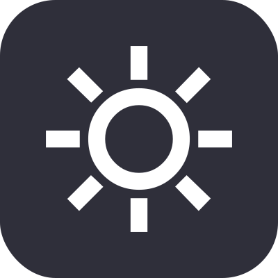
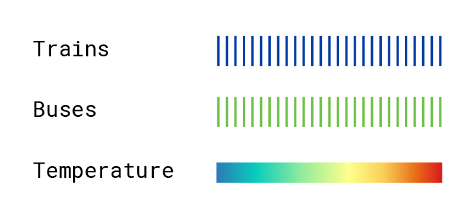

<nav id="left-panel" class="mta-sidebar">
    <ol id="" class="sidebar-contents">
        <li id="splash-title" class="">
            <h1>
            A Year of MTA Transit
            </h1>
        </li>
        <li id="subtitle" class="">
        How did weather affect ridership for trains and buses in 2023?
        </li>
        <li id="blurb" class="">
        This infographic shows the MTA’s daily public transportation ridership as the percentage change from average (calculated for both weekdays and weekends). Explore how weather impacts ridership using the filters below.
        </li>
        <li id="filters-groups">
            <div id="filters-title" class="">Explore the chart with filters</div>
            <ol id="transport-icon-list">
                <li class="icon-li" id="bus-button"></li>
                <li class="icon-li" id="train-button"></li>
            </ol> 
            <ol id="weather-icon-list">
                <li class="icon-li inactive" id="rain-button"></li>
                <li class="icon-li inactive" id="sun-button"></li>
                <li class="icon-li inactive" id="snow-button"></li>
                <li class="icon-li inactive" id="cloud-button"></li>
            </ol>
            <ol id="buttons-list">
                <li class="button"><p>Reset</p></li>
                <li class="button"><p>Apply</p></li>
            </ol>
        </li>
    </ol>
</nav>

<div id="container">
    <div id="legend"></div>
    <div id="tooltip">
        <div id="tooltip-info">
            <p> Hover over a bar in the chart to display info for that day </p>
        </div>
        <div id="rain-vid-container">
            <video autoplay muted loop>
                <source src="assets\rain.mp4" type="video/mp4">
            </video>
        </div>
        <div id="snow-vid-container">
            <video autoplay muted loop>
                <source src="assets\snow.mp4" type="video/mp4">
            </video>
        </div>
        <div id="sun-vid-container">
        <video autoplay muted loop>
            <source src="assets\sun.mp4" type="video/mp4">
        </video>
        </div>
        <div id="cloud-vid-container">
        <video autoplay muted loop>
            <source src="assets\cloud.mp4" type="video/mp4">
        </video>
    </div>
    </div>
    <div id="my_dataviz"></div>
</div>

```js
import {chart} from "./components/mta.js";

const mta_data = await FileAttachment("./data/MTA_Daily_Ridership_Data__Beginning_2020_20240930.csv").csv();
const weather_data = await FileAttachment("./data/new york city 2023-01-01 to 2023-12-31.csv").csv();

chart(weather_data, mta_data)

var bus_button = document.getElementById('bus-button');

bus_button.addEventListener("click", function(e) {
    e.preventDefault();
    console.log("toggle");
    var train_viz = document.getElementById('train-svg-g');
    var opacity = window.getComputedStyle(train_viz).getPropertyValue("opacity");
    console.log(opacity);
    if (opacity == .2) {
        train_viz.style.opacity = 1;
        bus_button.style.backgroundColor = "#2F2F3A";
    } else {
        train_viz.style.opacity = .2;
        bus_button.style.backgroundColor = "white";
    }
});

var train_button = document.getElementById('train-button');

train_button.addEventListener("click", function(e) {
    e.preventDefault();
    console.log("toggle");
    var bus_viz = document.getElementById('bus-svg-g');
    var opacity = window.getComputedStyle(bus_viz).getPropertyValue("opacity");
    console.log(opacity);
    if (opacity == .2) {
        bus_viz.style.opacity = 1;
        train_button.style.backgroundColor = "#2F2F3A";
    } else {
        bus_viz.style.opacity = .2;
        train_button.style.backgroundColor = "white";
    }
});

import {buttonEventListeners} from "./components/mta.js";
buttonEventListeners(weather_data);
```

<style>
#filters-groups div {
    padding-bottom: 25px;
    padding-top: 25px;
}
#filters-groups ol {
    padding-bottom: 25px;
    padding-top: 25px;
}
#filters-title {
    border-bottom: solid;
}
#buttons-list {
    display: flex;
    flex-flow: row;
    justify-content: space-evenly;
    padding: 0px;
}
.button {
    border-radius: 25px;
    width: 75px;
    height: 45px;
    border: solid;
    text-align: center;
    padding-bottom: 0px;
}
#transport-icon-list, #weather-icon-list {
    display: flex;
    flex-flow: row;
    justify-content: space-evenly;
    border-bottom: solid;
    padding-left: 0px;
    gap: 25px;
}
.sidebar-contents {
    padding-left: 0px;
    width: 100%;
    position: relative;
}
#transport-icon-list li {
    padding: 10px;
    width: 100px;
}
#transport-icon-list li img {
    max-width: 45px;
}
#weather-icon-list li {
    padding: 10px;
}
.icon-li {
    width: 40px;
    border-radius: 25px;
    border: 2px solid;
    display: flex;
    align-items: center;
    align-content: center;
    justify-items: center;
    justify-content: center;
}
#left-panel {
    font-family: "Roboto Mono", monospace;
}
.hero {
  display: flex;
  flex-direction: column;
  align-items: center;
  font-family: var(--sans-serif);
  margin: 4rem 0 8rem;
  text-wrap: balance;
  text-align: center;
}
.mta-sidebar {
    display: flex;
    position: fixed;
    left: 0;
    top: 0;
    bottom: 0;
    background: black;
    width: 21.75vw;
    box-sizing: border-box;
    overflow-y: auto;
    padding: 50px;
}
li {
    list-style: none;
    padding-bottom: 15px;
}
#splash-title h1 {
    font-size: 40px;
}
#observablehq-center {
    margin-left: 0px;
    margin-top: 0px;
    margin-bottom: 0px;
    background-color: white;
    padding-right: 0px;
}
#bus_dataviz {
    position: absolute;
}
#train_dataviz {
    position: absolute;
}
#temp_dataviz {
    position: absolute;
}
#my_dataviz {
    position: absolute;
    left: 50%;
    top: 50%;
    transform: translate(-50%,-50%);
    width: min-content;
    height: 100%;
    display: inline-block;
}
#container {
    position: absolute;
    width: 78.25vw;
    height: 100vh;
    transform: translate(21.75vw, 0);
    text-align: center;
}
#observablehq-main {
    min-width: 100vw;
    margin-top: 0px;
    max-height: 100vh;
    min-height: 100vh;
}
#observablehq-center {
    margin-right: 0px;
    max-height: 100vh;
}
#tooltip {
    position: absolute;
    text-align: center;
    padding: 1rem;
    background: black;
    color: white;
    border: 0px;
    pointer-events: none;
    font-size: 1rem;
    height: 29.5vh;
    width: 29.5vh;
    border-radius: 50%;
    display: flex;
    left: 50%;
    top: 50%;
    transform: translate(-50%,-50%);
    align-items: center;
    justify-content: center;
    font-family: "Roboto Mono", monospace;
    overflow: hidden;
}
#tooltip video {
    position: relative;
    display: block;
    width: 100%;
    height: 100%;
    opacity: 1;
}
#observablehq-toc {
    display: none;
}
#rain-vid-container {
    display: none;
    position: absolute;
    height: 1000px;
    width: 1000px;
}
#snow-vid-container {
    display: none;
    position: absolute;
    height: 1000px;
    width: 1000px;
}
#cloud-vid-container {
    display: none;
    position: absolute;
    height: 1000px;
    width: 1000px;
}
#sun-vid-container {
    display: none;
    position: absolute;
    height: 1000px;
    width: 1000px;
}
#tooltip-info {
    position: absolute;
    z-index: 100;
}
#legend {
    display: block;
    position: absolute;
    width: 10%;
    height: auto;

}
#legend img {
    display: block;
    position: relative;
    width: 100%;
    height: 100%;
}
.active {
    background-color: white;
}
#transport-icon-list li {
    background-color: #2F2F3A;
}
#weather-icon-list li {
    background-color: #2F2F3A;
}
#buttons-list li {
    background-color: #2F2F3A;
}
</style>

